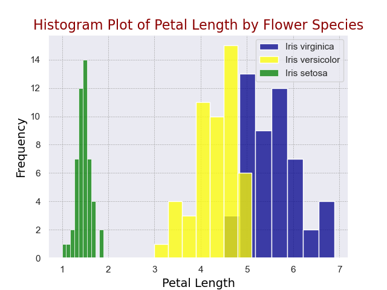
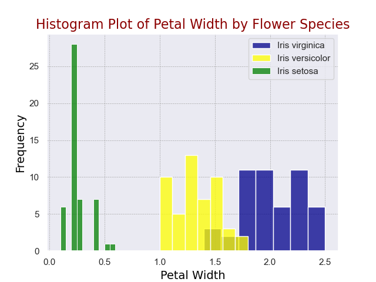
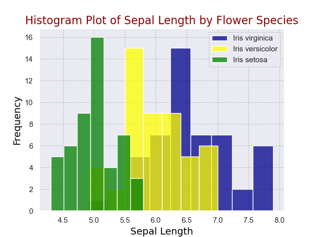
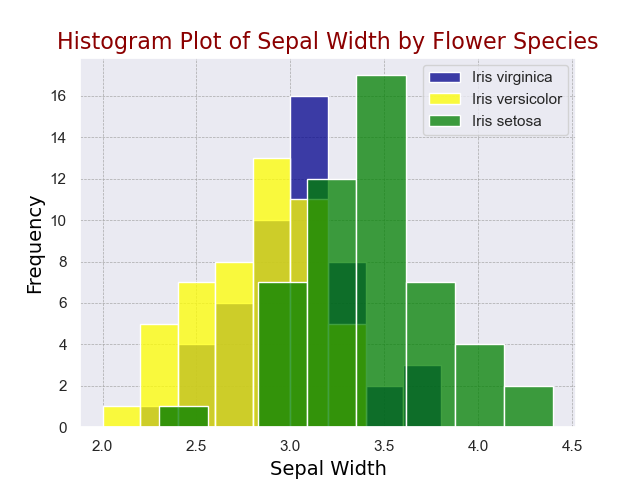
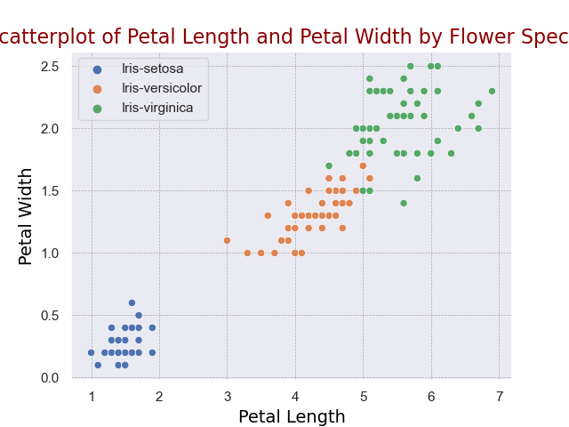
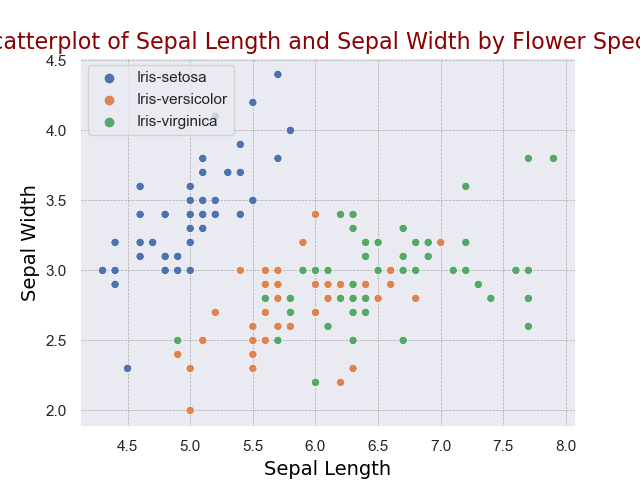
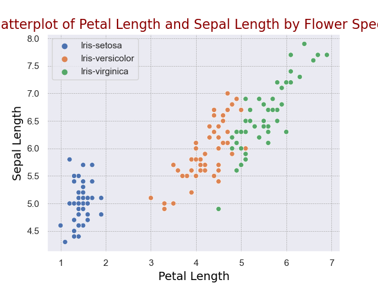
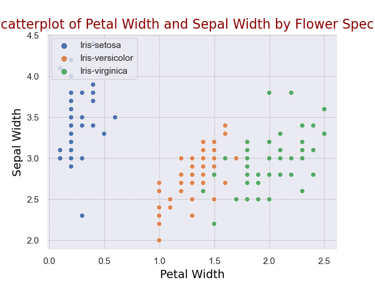

# pands-project

# **Iris Data Analysis using Python**
---
Author:   Daniel Mc Donagh

Student No: G00410864

Module:     Programming and Scripting

Project:    Analysis of Iris data set using Python programming

---
## Introduction

### Aims

This projects aim is to do data analysis on Fishers Iris data set (UCI Machine Learning Repository, 2007) utilising Python code to do the analysis. This project will show the research and investigation done on the data set through the description of the analysis techniques and the results gathered from the running python analysis programs on the data.

The project will be broken down into several basic tasks 

- Research of the Iris data set and summarisation to the README file
- Download and addition of the data set to the Project repository
-  Write analysis.py program to include
    - Output a summary of each variable to a single text file
    - Save a histogram of each variable to a png file
    - Output a scatter plot of each variable
    - Additional Analysis

### Background
The Iris dataset was first introduced by the British statistician and biologist Ronald Fisher in his 1936 paper "The use of multiple measurements in taxonomic problems" (Kaggle, 2023). The dataset consists of three species of Iris.
- Iris Setosa
- Iris Virginica
- Iris Versicolor

  

There are fifty samples of each species measured totalling 150 rows of data in the set. Each row of data consistes of four measurements taken of the lenght and width of the sepals and petals measured in centimeters.

Program
To run the program type "python analysis.py" into Terminal when located in the pands-project directory.

The program will create the summary.txt file, 4 histogram plots of sepal lenght and width and petal lenght and width for all 3 species amd finally 4 scatter plots comparing petal lenght and width, sepal leght and width, petal lenght to sepal lenght and petal width to sepal width for all 3 species.

The program was initially run and the autogenerated files saved to the project file.

Program Explanation
The data set was downloaded from https://archive.ics.uci.edu/ml/machine-learning-databases/iris/
The read_csv command was used from the pandas library module to read in the data from the csv file so that exploratory analysis could be carried out on the data. The data was further manipulated by using the display.precision command from the pandas library to only display up to 2 decimal places when ouputting data to the tables in the summary.txt file.

''''python
irisdata = pd.read_csv('iris_data.csv') 
pd.set_option("display.precision",2)
''''

The Summary.txt File was created and written to utilising the open command and the "w" argument to allow it to be written to.

iris_summary = open("summary.txt","w")  

The summary of the data was divided up into 5 sections
First was a condensed view of the data set with headings showing the first 5 and last 5 entries of the 150 in it.
Second the describe function was used to show total count, the mean, the standard deviation, the minimum, the maximum and interquartile ranges for all petals and sepals lenght and width.
Third the 3 species or class of irises were seperated out 
Fourth the individual count for all 3 classes
Fifth the describe function was used on each class of iris seperately. This used the groupby function to seperate the data into the 3 seperate classes.

Histograms
A function was defined for the creation of the histograms. The three classes of iris were split into their own classes each under a seperate variable 

iris_virginica
iris_versicolor
iris_setosa

Three parameters were provided to the function p1-3 for plotting the histogram. P1 is the variable being plotted. For the first histogram plot this would be "sepallenght", which would pass in the data under the sepallenght column from the iris data set. In this histogram the second parameter P2 would be the string "sepal lenght", which is then used to create the title for the histogram and the third parameter P3 is "sepal_lenght_histogram" which is used as the title for the automatically generated png file of the output.
The parameters are all passed in as arguments for the four histograms when the function histograms was defined.

''''python
def histograms(): 
    histogram_plot('sepallength', "Sepal Length", "sepal_length_histogram") 
    histogram_plot('sepalwidth', "Sepal Width", "sepal_width_histogram")
    histogram_plot('petallength', "Petal Length", "petal_length_histogram")
    histogram_plot('petalwidth', "Petal Width", "petal_width_histogram")
''''
The histograms Plots

  

  

  

  

Scatterplots
To create the scatterplots one scatterplot function was defined to contain 5 parameters that would allow passing in of arguments to the function to generate the four versions of scatterplots. 

The sns.scatterplot() function was used from the seaborn library to plot the scatterplots. The parameters P1 and P2 were used as the x-axis and y-axis data for the plots. Hue was set equal to 'class' for grouping of the data. The colour was set to 'deep' which would restrict the colours used to that palette. The plot titles were generated from the arguments P3 and P4. These would have been the strings 'Petal Length' and 'Petal Width' as shown in the below code for the first scatterplot. The final argument P5 would have passed in the name of the automatically generated scatterplot to be used when it was created.

''''python
def scatterplots(): 
    scatterplot("petallength", "petalwidth", "Petal Length", "Petal Width", "scatterplot_petal")
    scatterplot("sepallength", "sepalwidth", "Sepal Length", "Sepal Width", "scatterplot_sepal")
    scatterplot("petallength", "sepallength", "Petal Length", "Sepal Length", "scatterplot_petallength_sepallength")
    scatterplot("petalwidth", "sepalwidth", "Petal Width", "Sepal Width", "scatterplot_petalwidth_sepalwidth")
''''

The Scatterplots

## References

UCI Machine Learning Repository (2007) Available at: https://archive.ics.uci.edu/ml/machine-learning-databases/iris/ (Accessed: 12-4-2023)

Kaggle (2023) Available at: https://www.kaggle.com/datasets/arshid/iris-flower-dataset (Accessed: 12-4-2023)

GeeksforGeeks (2023) Available at: https://www.geeksforgeeks.org/exploratory-data-analysis-on-iris-dataset/
(Accessed: 17-4-2023)

Seaborn (2023) Available at: https://seaborn.pydata.org/generated/seaborn.scatterplot.html (Accessed: 6-4-2023)

Pandas (2023) Available at: https://pandas.pydata.org/docs/getting_started/intro_tutorials/06_calculate_statistics.html (Accessed: 5-4-2023)

Mathplotlib (2023) Available at: https://matplotlib.org/stable/gallery/statistics/hist.html#histograms (Accessed: 4-4-2023)